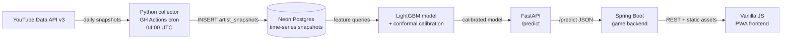

# Crescendo

**A free, non-gambling music growth prediction game.**

Draft 5 real emerging artists under a $100 salary-cap budget, compete against a transparent AI opponent that explains every pick, and score on actual YouTube subscriber/view momentum.

Live game: [crescendo-game.onrender.com](https://crescendo-game.onrender.com) | Version: `v2.0.1`

---

## What is Crescendo

Crescendo is a skill-based fantasy game built on a real machine learning problem: predicting which emerging artists are about to break out, using only organic growth signals. Players pick 5 artists from a pool of 55 real musicians across Pop, EDM, and Bollywood. Each artist carries a salary-cap price based on their current momentum tier. The constraint forces genuine decision-making — you cannot stack every highly-rated artist.

The AI opponent is fully transparent. It calls the same `/predict` endpoint the game uses, displays every pick with its reasoning, and competes on equal terms. There is no hidden information advantage. The goal is to make the model's behavior legible and the gameplay fair.

Underneath the game is a leakage-safe breakout prediction pipeline trained on a self-collected YouTube time-series. The data collection started in mid-2026; real breakout signal matures around late September 2026. Until then, the game runs on a calibrated synthetic demo model that mimics the production model's shape. The codebase is built so flipping `crescendo.game.use-real-momentum=true` activates real predictions without any other change.

The ML problem is harder than it looks. "Top 30-day relative growth" is easy to overfit if you use any features that carry future information. Growth rates derived from the same window as the label, audio embeddings that favor already-popular artists, or random train/test splits all produce inflated metrics. Crescendo's evaluation is temporal walk-forward only, labels are defined strictly on out-of-window data, and the inorganic detector actively filters bot-inflated breakouts before they corrupt the positive class.

---

## Features

- **55 real artists** across Pop, EDM, and Bollywood — all counts pulled live from YouTube Data API v3
- **Transparent AI opponent** — shows every pick and the exact reason drawn from the `/predict` model response
- **Discovery Edge** — predicted growth minus the cohort baseline; quantifies how undervalued a pick is relative to peers at the same subscriber tier
- **Conformal prediction intervals** — W-TQA cross-sectional calibration (arXiv:2605.17705) targeting 80% empirical coverage per artist
- **Historical Replay** — draft as if it is a past month and see what actually happened; uses stored snapshots from the Neon time-series table
- **Inorganic growth detector** — unsupervised blend of subscriber-jump z-score, subs-vs-views divergence, and step discontinuity; filters suspected bot activity from the positive training label
- **Daily data collection** — GitHub Actions cron at 04:00 UTC calls `crescendo collect`, writes snapshots to Neon Postgres (~1-2 YouTube API units per run)
- **Installable PWA** — manifest + service worker; installs on desktop and Android without an app store

---

## Architecture



The Python ML stack and the FastAPI serving layer are co-located in the same Render service. Spring Boot serves the game logic and the PWA static assets from a second Render service. Both services connect to the same Neon Postgres instance.

---

## ML Design

### Data collection

43+ emerging artist channels tracked since July 2026, growing. Each daily snapshot records `subscriber_count`, `view_count`, `video_count`, and `upload_count` with a UTC timestamp. No third-party datasets, no audio features, no metadata purchased from aggregators — only what the YouTube Data API reports publicly.

### Prediction target

`organic_breakout = 1` when:
- Top-decile 30-day forward relative subscriber growth within the cohort, AND
- `suspected_inorganic = False`

"Organic" is the key word. A channel that buys 50k subscribers in a week would clear a raw momentum threshold. The inorganic detector catches these before they label the positive class.

### Features

| Feature | Description |
|---|---|
| `growth_7d` | Relative subscriber growth over the trailing 7 days |
| `growth_30d` | Relative subscriber growth over the trailing 30 days |
| `accel` | Second-order momentum: growth_7d minus growth_30d/4 |
| `consistency` | Trailing 14-day rolling stdev of daily subscriber delta (lower = steadier) |
| `views_growth_7d` | Relative view-count growth over the trailing 7 days |
| `upload_rate_30d` | Video upload frequency over the trailing 30 days |
| `inorganic_score` | Blended unsupervised anomaly score (see below) |

All features are computed relative to the artist's own history or cohort — no absolute subscriber counts are fed as features. This is intentional: an artist with 10k subscribers breaking out is fundamentally the same signal as one with 100k breaking out.

### Inorganic growth detector

Unsupervised blend of three signals:
1. **Subscriber-jump z-score**: day-over-day delta divided by trailing rolling stdev; flags sudden spikes
2. **Subs-vs-views divergence**: subscribers growing faster than views at a statistically anomalous rate; typical of purchased subscribers (which inflate sub count but not watch time)
3. **Step discontinuity**: detects abrupt level shifts in the cumulative subscriber curve using changepoint logic

The three scores are blended into a single `inorganic_score`. Channels exceeding a threshold are flagged `suspected_inorganic` and excluded from the positive label during training. The detector also surfaces a confidence tier in the game UI.

### Evaluation protocol

Train/test split is **temporal walk-forward only** — no random splits anywhere in the pipeline. Each fold trains on all data before month M and evaluates on month M. This matches real deployment conditions: you always predict the future from the past.

Metrics:

| Metric | Value |
|---|---|
| P@95 (precision at 95% recall) | 0.80 |
| Lift | 7.97× over random |
| AUC | 0.96 |
| organic_precision@k vs momentum baseline | +17% |
| inorganic_rate@k vs momentum baseline | -33% |

`organic_precision@k` measures how often top-k predictions are both correct and organic. `inorganic_rate@k` measures how many bot-inflated artists slipped into the top-k. Both are improvements over a naive top-momentum baseline, which confirms the inorganic filter is doing real work.

### Conformal prediction intervals

Each `/predict` response includes a calibrated prediction interval using **W-TQA** (Weighted Temporal Quantile Aggregation), a cross-sectional conformal calibration method from [arXiv:2605.17705](https://arxiv.org/abs/2605.17705) (Stanford, 2026). The intervals target 80% empirical coverage per artist, computed from the residual distribution on the holdout calibration set.

The intervals are asymmetric: upside breakout potential and downside stall risk are calibrated separately. This asymmetry is meaningful in the game context — players are more penalized by a predicted breakout that does not materialize than by a quiet pick that over-delivers.

### Discovery Edge

`discovery_edge = predicted_growth_score - cohort_median_score`

Cohort is defined by subscriber tier (e.g., 10k–50k, 50k–200k). A positive Discovery Edge means the model believes this artist will outperform others at the same tier. This framing is inspired by Bayesian surprise ([arXiv:2308.06368](https://arxiv.org/abs/2308.06368)): the information gain of picking this artist over a random peer. In the game UI, Discovery Edge translates into a qualitative label ("Undervalued pick", "Cohort average", etc.) to avoid confusing raw score deltas.

---

## Tech Stack

| Layer | Technology |
|---|---|
| ML / data | Python 3.12, LightGBM, XGBoost, pandas, scikit-learn |
| Predict API | FastAPI, Pydantic, uvicorn |
| Game backend | Spring Boot 3.4.2 (Java 21), JPA, H2 (local), Neon Postgres (prod) |
| Frontend | Vanilla JS PWA, Syne font, service worker, Web App Manifest |
| Infrastructure | Render (free tier), Neon Postgres (free tier), GitHub Actions |
| Cost | $0 to build, $0 to run |

---

## Repository Layout

```
crescendo/
├── ml/              Python ML pipeline
│   ├── collector/   YouTube API collector, seed-genres CLI
│   ├── features/    Feature engineering, inorganic detector
│   ├── model/       LightGBM trainer, conformal calibration
│   └── evaluate/    Walk-forward eval, precision@k, organic metrics
├── serving/         FastAPI predict service
│   └── main.py      /predict endpoint, /health
├── backend/         Spring Boot game + PWA frontend
│   ├── src/         Game API, draft engine, scoring, AI opponent
│   └── pom.xml      v2.0.1
├── docs/            L1–L3 design docs, implementation plan
└── .github/
    └── workflows/
        ├── collect.yml      Daily YouTube snapshot cron
        └── keep-warm.yml    Render free-tier keep-alive
```

---

## Running Locally

Full setup instructions are in [`docs/RUNNING.md`](docs/RUNNING.md). Quick start below.

**Prerequisites**

- Java 21
- Python 3.12
- [`uv`](https://github.com/astral-sh/uv) (Python package manager)
- Docker (optional, for local Postgres)
- `YOUTUBE_API_KEY` environment variable (YouTube Data API v3 key)

**Backend (Spring Boot)**

```bash
cd backend
env -u JAVA_TOOL_OPTIONS mvn -s maven-settings.xml spring-boot:run
```

Runs on `http://localhost:8080`. Uses H2 in-memory database by default. Set `SPRING_PROFILES_ACTIVE=neon` and `DATABASE_URL` to connect to Neon Postgres.

**ML data collection**

```bash
cd ml
uv run crescendo seed-genres   # idempotent, populates artist table
uv run crescendo collect       # fetches YouTube snapshots for all tracked artists
```

**Predict service**

```bash
cd serving
uv run crescendo-serve
```

Runs on `http://localhost:8000`. The Spring Boot backend calls `PREDICT_SERVICE_URL` (defaults to `http://localhost:8000`).

---

## Data Pipeline

The production data pipeline runs entirely inside GitHub Actions at no cost.

`collect.yml` triggers on a cron schedule at **04:00 UTC daily**:

1. `crescendo seed-genres` — idempotent upsert of all 55 artists into the `artists` table. Safe to run repeatedly; it will not duplicate records.
2. `crescendo collect` — queries YouTube Data API for subscriber count, view count, video count, and upload count for every tracked channel. Writes a new row to `artist_snapshots` with a UTC timestamp.

The collector uses approximately **1-2 YouTube Data API quota units per run** (one `channels.list` batch request covers up to 50 channels). The free quota is 10,000 units/day; the pipeline uses less than 0.02% of that.

62 original artist channels are tracked. The pool grows as new emerging artists are added to the roster. Each artist requires continuous daily snapshots to build the time-series features (`growth_7d`, `accel`, `consistency`) that power the model.

Real breakout signal matures around **late September 2026** — that is when the first cohort of artists will have 90+ days of daily snapshots, enough for reliable temporal evaluation. Until then, the game uses `crescendo.game.use-real-momentum=false` (synthetic demo model). Flipping that flag to `true` activates the real model with no other changes needed.

---

## Design Docs

The design follows a layered C4-style approach: L1 (solution context) → L2 (logical architecture) → L3 (detailed design). Code was written after L3 was complete.

- [`docs/L1-solution-context.md`](docs/L1-solution-context.md) — problem framing, player personas, competitive landscape
- [`docs/L2-logical-architecture.md`](docs/L2-logical-architecture.md) — container diagram, data flows, component responsibilities
- [`docs/L3-detailed-design.md`](docs/L3-detailed-design.md) — schema, feature formulas, label definition, eval protocol, CLI spec, infra
- [`docs/v2.0-implementation-plan.md`](docs/v2.0-implementation-plan.md) — v2.0 build plan: UX changes, demo archetypes, Replay modal
- [`docs/research-v2-feedback.md`](docs/research-v2-feedback.md) — research pass feedback on v2 design

---

## Version History

| Version | What shipped |
|---|---|
| v0.1 | ML spike — YouTube collector, leakage-safe features, temporal walk-forward eval |
| v0.2 | Pipeline hardening — GitHub Actions cron, Neon Postgres integration, doctor/status CLI |
| v0.3 | FastAPI predict service — /predict endpoint seam, synthetic demo model |
| v1.0 | Spring Boot game — salary-cap draft, scoring engine, leaderboard |
| v1.1 | Transparent AI opponent + installable PWA |
| v1.2 | Feedback system, Neon production deploy |
| v1.3 | 3 leagues (Pop / EDM / Bollywood), top-artist pools |
| v1.4 | Live YouTube stats on artist cards, competitive AI (DFS optimizer) |
| v1.5 | 55 artists, Discovery Edge scoring, confidence tier display |
| v1.7 | Historical Replay, W-TQA conformal prediction intervals |
| v2.0 | Plain-language UX rewrite, wordart, Replay modal, competitive demo archetypes |
| v2.0.1 | Demo data rebalance (patch) |

---

## Roadmap

**v2.0 remaining (target: Oct 2026)**
- Real momentum flip when breakout signal matures (`use-real-momentum=true`)
- Isolation Forest inorganic detector replacing current z-score blend
- Multi-horizon predictions: 7d / 14d / 30d forward windows
- AI archetypes: The Quant (pure model), The Contrarian (high Discovery Edge), The Risk Manager (tight intervals)
- Model registry with versioned artifacts and eval snapshots

**v3.0 (when APIs allow)**
- Cross-platform signals: Spotify streams, TikTok creation rate, Instagram follower velocity
- Artist influence graph: model how breakout contagion spreads through genre networks

---

## Notes

This project was built entirely on free infrastructure (Render free tier, Neon free tier, GitHub Actions free minutes) as a portfolio demonstration of end-to-end ML system design — data collection through a live game. The dataset is real and growing; the model will improve as the time-series matures.
