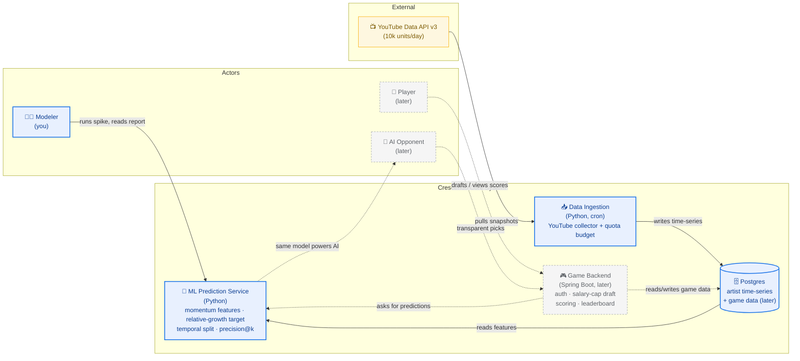

# Crescendo — L1 System Context Diagram

> Renders natively on GitHub (Mermaid in a fenced code block).
> **Solid arrows = MVP (modeling spike). Dashed arrows = later scope (game / AI opponent).**

