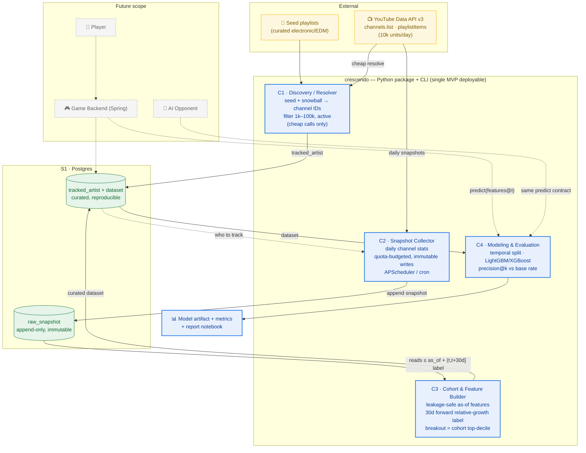

# Crescendo — L2 Container & Data-Flow Diagram

> Logical components of the MVP spike + the raw→curated data boundary.
> **Solid = MVP. Dashed = future (game / AI opponent). Blue = MVP components, amber = external, grey = later.**

## Reading the diagram

1. **C1** seeds from curated playlists + cheap YouTube calls → writes `tracked_artist`.
2. **C2** snapshots those artists daily → appends immutable rows to `raw_snapshot`.
3. **C3** reads raw snapshots with strict as-of / forward-window boundaries → writes a
   curated, reproducible `dataset` (this is where leakage is prevented).
4. **C4** does a temporal split, trains, and evaluates precision@k vs base rate → report.
5. **Future (dashed):** the game backend and AI opponent both call **C4's prediction
   contract** — the single seam that keeps the model swappable and the AI "honest".
